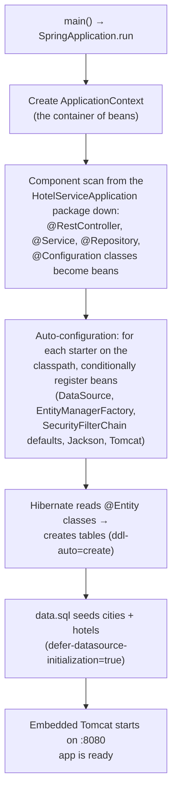
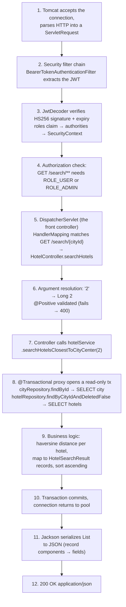

# Spring Boot Interview Guide

Learn Spring Boot by following one real request through this codebase. Two parts:
**the life of a request** (what the framework actually does, step by step) and a
**reference of every annotation used in this project** (what it does, where it is, what
an interviewer wants to hear about it).

---

## Part 1 — What happens at startup

Before any request, `HotelServiceApplication.main()` runs `SpringApplication.run(...)`:



Interview sound bite: *"A starter brings dependencies; auto-configuration brings beans —
each `@AutoConfiguration` is guarded by `@ConditionalOnClass`/`@ConditionalOnMissingBean`,
so my own beans always win over the defaults."*

Key startup facts you can defend from this repo:

- **Beans & DI**: Spring instantiates each component once (singleton scope) and injects
  constructor arguments from the context. Every class here uses **constructor injection** —
  no `@Autowired` on fields (final fields, explicit dependencies, easy to test).
- **Repository magic**: `HotelRepository` is just an interface. At startup Spring Data
  creates a proxy implementation; `findByCityIdAndDeletedFalse` is parsed from the *method
  name* into `WHERE city_id = ? AND deleted = false`.
- **`@Transactional` magic**: the service bean is wrapped in a proxy that opens/commits a
  transaction around each annotated method. That's why a self-call (`this.method()`)
  bypasses transactions — a favorite interview trap.

---

## Part 2 — The life of a request

### `GET /search/2` with `Authorization: Bearer <token>`



What to emphasize per step:

- **Steps 2–4 happen before any of my code.** Security is a chain of servlet filters in
  front of the DispatcherServlet. Missing/invalid token → 401 emitted by the filter — the
  controller never runs. Wrong role → 403.
- **Step 5**: `DispatcherServlet` is the single entry point of Spring MVC ("front
  controller" pattern). It delegates to `HandlerMapping` (which method?), then
  `HandlerAdapter` (invoke it), then `HttpMessageConverter` (serialize the result).
- **Step 6**: `@PathVariable` conversion failing (`/hotel/abc`) throws
  `MethodArgumentTypeMismatchException` → our advice → 400. Constraint failing (`/hotel/-1`)
  throws `ConstraintViolationException` → 400.
- **Step 8**: `readOnly = true` is a hint that lets Hibernate skip dirty-checking
  snapshots — a real performance win on read-heavy paths.
- **Step 11**: `@RestController` = `@Controller` + `@ResponseBody`: return values go
  through Jackson to the body, never to a view resolver.

### `DELETE /hotel/4` (soft delete) — the interesting differences

1. Authorization rule is method-specific: `requestMatchers(HttpMethod.DELETE, "/hotel/**").hasRole("ADMIN")`.
2. In the service, the transaction is **read-write**. We load the entity, call
   `hotel.setDeleted(true)` — and that alone is enough: Hibernate's **dirty checking**
   compares the managed entity against its load-time snapshot at commit and issues the
   `UPDATE`. The explicit `save()` is belt-and-braces.
3. Nothing is deleted: `GET /hotel/4` now 404s (business rule in the service), and search
   excludes it (the derived query's `DeletedFalse`).

### `POST /auth/login` — how a token is born

1. Public endpoint (permitted in `SecurityConfig`), body deserialized by Jackson into the
   `LoginRequest` record, `@Valid` runs `@NotBlank` checks.
2. `AuthenticationManager.authenticate(...)` → `DaoAuthenticationProvider` loads the user
   from the in-memory `UserDetailsService` and compares passwords with **BCrypt**.
   Failure throws `BadCredentialsException` → our advice → RFC 7807 401.
3. `TokenService` builds claims (`sub`, `iss`, `iat`, `exp`, `roles`) and `JwtEncoder`
   signs them with the HS256 secret. The client sends this token on every later call.

### When anything goes wrong

Every exception funnels into `GlobalExceptionHandler` (`@RestControllerAdvice`) and comes
out as the same shape:

```json
{ "status": 404, "title": "Resource not found", "detail": "Hotel not found with id: 99", "instance": "/hotel/99" }
```

| Exception | Status |
|---|---|
| `ResourceNotFoundException` (ours) | 404 |
| `AuthenticationException` (bad login) | 401 |
| `ConstraintViolationException` (`@Positive` failed) | 400 |
| `MethodArgumentTypeMismatchException` (`/hotel/abc`) | 400 |
| anything else | 500 — logged fully, returned generically |

---

## Part 3 — Every annotation in this project

### Core / bootstrapping

| Annotation | Used in | What it does |
|---|---|---|
| `@SpringBootApplication` | `HotelServiceApplication` | Shorthand for `@Configuration` + `@EnableAutoConfiguration` + `@ComponentScan`. Defines the root package for scanning |
| `@ConfigurationPropertiesScan` | `HotelServiceApplication` | Finds and registers all `@ConfigurationProperties` classes without listing them one by one |
| `@Configuration` | `SecurityConfig`, `JwtConfig`, `OpenApiConfig`, `AppConfig` | Class declares beans; Spring processes its `@Bean` methods at startup |
| `@Bean` | config classes | The method's return value becomes a container-managed bean, injectable anywhere |
| `@Component` | `HaversineDistanceCalculator`, `HotelAuditListener`, `HotelStatsReporter` | The generic stereotype: "make this class a bean". `@Service`, `@Repository`, `@RestController` are specializations of it |
| `@Value("${prop}")` | `SecurityConfig` | Injects a single property (from properties files, env vars, CLI args — in that precedence order, last wins) |
| `@ConfigurationProperties(prefix)` | `JwtProperties` | Binds a whole prefix (`app.security.jwt.*`) into a typed, immutable record — the production-preferred alternative to many `@Value`s; combined with `@Validated`, a bad config fails at startup, not at first use |
| `@Profile("!prod")` | `AppConfig.seedDataReport` | The bean only exists when the profile expression matches — here, a dev-only startup report that vanishes in production |
| `@ConditionalOnProperty` | `HotelStatsReporter` | The bean only exists when a property has the required value — a feature flag at the bean level. Boot's entire auto-configuration is built from `@Conditional*` annotations like this |
| `@PostConstruct` | `HotelAuditListener` | Lifecycle callback: runs once after dependency injection completes (its counterpart `@PreDestroy` runs at shutdown) |
| `@Primary` | `HaversineDistanceCalculator` | When several beans implement one interface, this one wins un-qualified injection points |
| `@Qualifier("name")` | `HotelServiceImpl` constructor | Explicitly picks a bean by name when several candidates exist — the other side of the `@Primary` coin |

### Web (Spring MVC)

| Annotation | Used in | What it does |
|---|---|---|
| `@RestController` | controllers | `@Controller` + `@ResponseBody`: component-scanned bean whose return values are written to the response body as JSON |
| `@RequestMapping("/city")` (class level) | `CityController` | Base path for every handler in the class; method-level mappings are relative to it |
| `@GetMapping` / `@PostMapping` / `@PutMapping` / `@DeleteMapping` | controllers | Shorthand for `@RequestMapping(method = ...)`; binds URL + verb to a method. PUT = full replacement of the resource (vs `@PatchMapping` = partial) |
| `@PathVariable` | `HotelController` | Binds a URI template segment (`/hotel/{id}`) to a parameter, with type conversion |
| `@RequestParam` | `searchHotels(..., limit)` | Binds a query-string parameter (`?limit=3`); `required = false` makes it optional (nullable), `defaultValue` is the other common option |
| `@RequestBody` | `AuthController`, `updateHotel` | Deserializes the JSON body into the parameter object via Jackson |
| `@CrossOrigin` | `CityController` | Adds CORS headers so a browser app on another origin may call this controller; production usually configures CORS globally instead |
| `@RestControllerAdvice` | `GlobalExceptionHandler` | Cross-cutting advice for all controllers; here, centralized exception → response mapping. **The "advice" family**: `@ControllerAdvice` is the base annotation (its handlers can return view names); `@RestControllerAdvice` = `@ControllerAdvice` + `@ResponseBody`, so every handler's return value is serialized straight to the response body — the right one for a JSON API. "Advice" is AOP vocabulary: code that runs *around* your handlers without living in them |
| `@ExceptionHandler` | `GlobalExceptionHandler` | Marks the method handling a given exception type; the most specific matching type wins (why our 401/400 handlers beat the `Exception` catch-all) |
| `@ResponseStatus` | `ResourceNotFoundException` | Default status when the exception escapes without an advice handling it |

### Persistence (JPA / Spring Data)

| Annotation | Used in | What it does |
|---|---|---|
| `@Entity` | `Hotel`, `City` | Maps the class to a table; Hibernate manages instances of it |
| `@Table(name = ...)` | entities | Explicit table name instead of the derived one |
| `@Id` | entities | Primary key field |
| `@GeneratedValue(strategy = IDENTITY)` | entities | DB auto-increment generates the key on insert |
| `@ManyToOne` + `@JoinColumn(name = "city_id")` | `Hotel.city` | Many hotels → one city, via the `city_id` FK column. Fetch type for `@ManyToOne` defaults to EAGER — worth knowing |
| `@Column(nullable = false, length = 120)` | `Hotel.name` | Column-level constraints in the generated schema; the DB rejects a null name even if application code forgets to |
| `@Repository` | repository interfaces | Component stereotype (also enables persistence-exception translation). Optional on Spring Data interfaces — extending `JpaRepository` is already enough |
| `@Query` + `@Param` | `HotelRepository.countActive*` | Hand-written JPQL for when a derived method name would get unreadable; `@Param` names the placeholder (`:cityId`) |
| `@Transactional` / `@Transactional(readOnly = true)` | `HotelServiceImpl` | Wraps the method in a transaction via proxy. `readOnly` skips dirty-check snapshots. Default: rollback on unchecked exceptions only |
| `@EnableJpaAuditing` | `AppConfig` | Activates Spring Data's auditing machinery — without it, `@CreatedDate`/`@LastModifiedDate` silently stay null |
| `@EntityListeners(AuditingEntityListener.class)` | `Hotel` | Hooks the auditing listener into this entity's lifecycle events |
| `@CreatedDate` / `@LastModifiedDate` | `Hotel.createdAt/updatedAt` | Auto-stamped on insert / on every update — an audit trail with zero code in services (`@CreatedBy`/`@LastModifiedBy` are the who-variants) |

### Validation

| Annotation | Used in | What it does |
|---|---|---|
| `@Validated` | `HotelController` (class level), `JwtProperties` | Enables constraint checking on method parameters (needed for `@Positive` on path variables) and on configuration binding |
| `@Positive` | path variables, `limit` param | Value must be > 0, else `ConstraintViolationException` → 400 |
| `@Valid` | login + update request bodies | Cascades bean validation into the request body object |
| `@NotBlank` | `LoginRequest`, `UpdateHotelRequest` | Field must be non-null and contain non-whitespace |
| `@NotNull` | `UpdateHotelRequest` coordinates | Field must be present (a blank check makes no sense for numbers) |
| `@Min(1)` / `@Max(5)` | `UpdateHotelRequest.rating` | Integer range bounds — rating 9 is rejected with a 400 before any code runs |
| `@DecimalMin` / `@DecimalMax` | latitude/longitude | Range bounds for floating-point values (latitude must be within ±90) |
| `@Size(min = 32)` | `JwtProperties.secret` | Length constraint — here it makes a too-short JWT secret a startup failure |

### Caching, scheduling, async & events

| Annotation | Used in | What it does |
|---|---|---|
| `@EnableCaching` | `AppConfig` | Turns on the caching proxy machinery; without it `@Cacheable` is silently ignored |
| `@Cacheable(cacheNames = "hotels", key = "#id")` | `getHotelById` | First call runs the method and stores the result; repeat calls with the same key skip the method (and the DB) entirely |
| `@CacheEvict` | `deleteHotelById`, `updateHotel` | Removes the entry on mutation so readers never see stale data — the crucial discipline that makes caching correct, not just fast |
| `@EnableScheduling` | `AppConfig` | Activates the scheduler that discovers `@Scheduled` methods |
| `@Scheduled(fixedRate = 300_000)` | `HotelStatsReporter` | Runs the method periodically on a background thread (`cron = "..."` is the calendar-based alternative) |
| `@EnableAsync` | `AppConfig` | Activates async method execution |
| `@Async` | `HotelAuditListener` | The method runs on a task-executor thread; the caller doesn't wait. Same proxy caveat as `@Transactional`: self-invocation bypasses it |
| `@EventListener` | `HotelAuditListener` | Subscribes the method to application events by parameter type — the service publishes `HotelDeletedEvent` without knowing who listens (decoupling). `@TransactionalEventListener` is the variant that waits for the transaction to commit |

### Security

| Annotation | Used in | What it does |
|---|---|---|
| `@EnableWebSecurity` | `SecurityConfig` | Activates Spring Security's web support; our `SecurityFilterChain` bean replaces the default |
| `@Service` | `TokenService`, `HotelServiceImpl` | Business-logic stereotype; picked up by component scan |

(Most security behavior here is configured through the `HttpSecurity` DSL rather than
annotations — say that in interviews: URL rules live in one place. The annotation
alternative is `@PreAuthorize("hasRole('ADMIN')")` with `@EnableMethodSecurity`.)

### OpenAPI (springdoc)

| Annotation | Used in | What it does |
|---|---|---|
| `@Tag` | controllers | Groups endpoints in Swagger UI |
| `@Operation` | endpoint methods | Summary + description shown in the docs |
| `@ApiResponses` / `@ApiResponse` | endpoint methods | Documents each status code the endpoint can return |
| `@SecurityRequirements` (empty) | `AuthController.login` | Marks the endpoint as not requiring auth in the docs |

### Testing

| Annotation | Used in | What it does |
|---|---|---|
| `@SpringBootTest` | integration test | Boots the full application context (all beans, real security, H2) |
| `@AutoConfigureMockMvc` | integration test | Provides `MockMvc` — drives the real DispatcherServlet + filter chain without a network socket |
| `@Autowired` | test fields | Field injection is acceptable in tests (the test class isn't a managed production bean) |
| `@Test` / `@BeforeEach` | JUnit 5 | Test method / per-test setup (here: obtaining fresh JWTs) |

---

## Part 4 — Questions this project prepares you to answer

1. **"Walk me through what happens when a request hits your API."** → Part 2, step by step.
2. **"How does Spring Boot auto-configuration work?"** → conditional beans; your beans win.
3. **"Constructor vs field injection?"** → this repo is 100% constructor injection; explain why.
4. **"How would you implement soft delete?"** → flag + filtered queries; discuss `@SQLRestriction` at scale.
5. **"How does `@Transactional` actually work?"** → proxies; self-invocation trap; readOnly.
6. **"JWT vs sessions?"** → stateless, horizontal scaling, revocation trade-off, expiry+refresh.
7. **"Where would you put validation?"** → at the edge (annotations) + business rules in services.
8. **"How do you handle errors consistently?"** → one advice, RFC 7807, log-but-don't-leak.
9. **"How do you test a secured endpoint?"** → real login in `@BeforeEach`, assert 401/403/200.
10. **"How do you take this to production?"** → prod profile, env secrets, `ddl-auto=validate`,
    actuator probes, graceful shutdown — all already in the repo.
