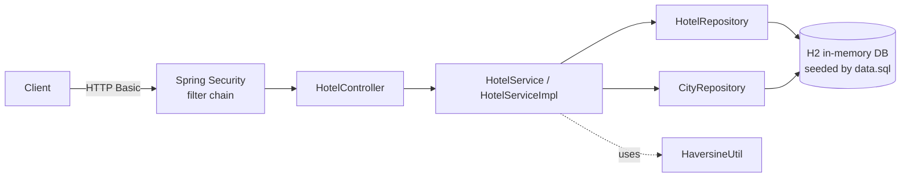
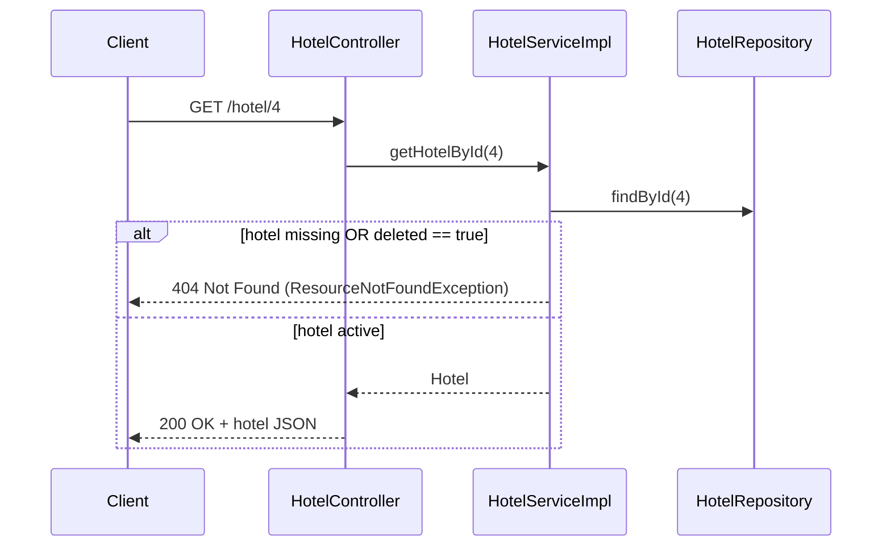
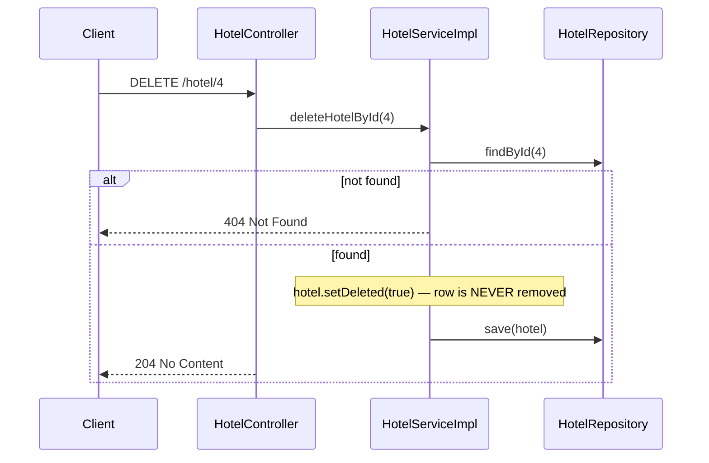
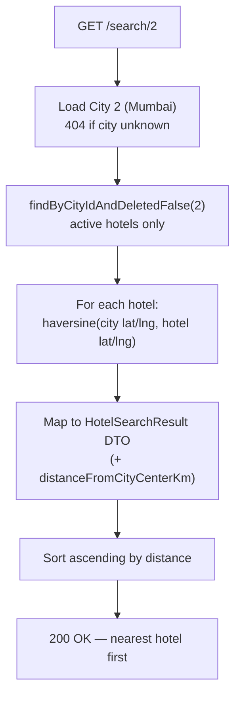
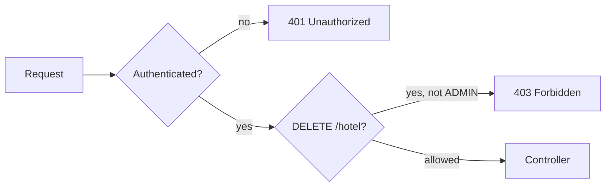

# Hotel Service — Project Flow

A Spring Boot REST service (Boot 4.1.0, Java 21, H2 in-memory DB) simulating the HackerRank
hotel question: fetch a hotel, soft-delete a hotel, and search a city's hotels sorted by
distance from the city center — hardened with Spring Security, OpenAPI/Swagger docs,
Actuator monitoring, bean validation and RFC 7807 error responses.

## The big picture

Every request passes through the same four layers. No layer skips another: the controller
never touches a repository, and the service never builds HTTP responses.



| Layer | Class | Responsibility |
|---|---|---|
| Security | `SecurityConfig` | Stateless HTTP Basic; role checks before any controller runs |
| Controller | `HotelController` | Maps URLs to service calls, validates path ids (`@Positive`), wraps results in `ResponseEntity` |
| Error handling | `GlobalExceptionHandler` | Converts every exception to an RFC 7807 problem-detail body |
| Service | `HotelServiceImpl` | Business rules: not-found checks, soft-delete flag, distance sort |
| Repository | `HotelRepository`, `CityRepository` | Spring Data JPA queries — no hand-written SQL |
| Model | `Hotel`, `City` | JPA entities; `Hotel.deleted` is the soft-delete flag |

At startup, Hibernate creates the schema from the entities (`ddl-auto=create`), then
`data.sql` seeds 3 cities and 10 hotels (one pre-marked `deleted = true`).

## Q1 — `GET /hotel/{id}`



The key rule: a soft-deleted hotel is treated exactly like a missing one — the API returns
404 even though the row still exists.

## Q2 — `DELETE /hotel/{id}` (soft delete)



After this, `GET /hotel/4` returns 404 and `/search/{cityId}` excludes it — but
`SELECT * FROM hotel WHERE id = 4` still shows the row with `DELETED = TRUE`.

## Q3 — `GET /search/{cityId}` (closest to city center)



The distance comes from `HaversineUtil.distanceKm` — the haversine great-circle formula
with Earth radius 6371 km:

```
a = sin²(Δlat/2) + cos(lat1)·cos(lat2)·sin²(Δlon/2)
d = 2R · atan2(√a, √(1−a))
```

## Where the data lives

- `application.properties` — H2 URL `jdbc:h2:mem:hoteldb`, H2 console at `/h2-console`,
  `defer-datasource-initialization=true` so `data.sql` runs after Hibernate builds the schema.
- `data.sql` — cities: New Delhi (1), Mumbai (2), Bengaluru (3); hotels 1–10 with real-ish
  coordinates. Hotel 10 is seeded as already deleted, proving the search filter works.
- In-memory DB: every restart resets to this seed state.

## Security model

Stateless HTTP Basic auth with two in-memory users (credentials come from properties, so
production injects them via environment variables — see `application-prod.properties`):

| Who | Can do |
|---|---|
| *anonymous* | Swagger UI, `/v3/api-docs`, H2 console, `/actuator/health`, `/actuator/info` |
| `user` / `user123` (ROLE_USER) | `GET /hotel/{id}`, `GET /search/{cityId}` |
| `admin` / `admin123` (ROLE_ADMIN) | everything above + `DELETE /hotel/{id}` + full actuator |



## Production aspects

- **OpenAPI / Swagger** (springdoc 3.1.0) — interactive docs at `/swagger-ui.html`, machine-readable
  spec at `/v3/api-docs`; every endpoint annotated with summaries and response codes, and the
  UI has an Authorize button for Basic auth.
- **Actuator** — `/actuator/health` (with liveness/readiness probes) and `/actuator/info` public
  for load balancers; `/actuator/metrics` admin-only.
- **Validation** — path ids must be positive numbers; violations return 400 with a clear message.
- **Consistent errors** — every failure (404, 400, 500) is an RFC 7807 `application/problem+json`
  body; stack traces are logged server-side, never leaked to clients.
- **Prod profile** — `application-prod.properties`: real DB via `DB_URL`/`DB_USERNAME`/`DB_PASSWORD`,
  `ddl-auto=validate`, no seeding, no H2 console, secrets only from the environment.
- **Graceful shutdown** — in-flight requests finish before the server stops.

## Running and verifying

```bash
./mvnw spring-boot:run                                   # start on :8080
open http://localhost:8080/swagger-ui.html               # interactive API docs
curl -u user:user123 localhost:8080/hotel/1              # Q1
curl -u admin:admin123 -X DELETE localhost:8080/hotel/4  # Q2 (admin only)
curl -u user:user123 localhost:8080/search/2             # Q3 — nearest first
./mvnw test                                              # 13 tests
```

The integration test (`HotelControllerIntegrationTest`) covers every branch above:
200/404 on get, soft-delete persistence, distance ordering, deleted-hotel exclusion,
404 for an unknown city, 401 without credentials, 403 for non-admin delete, public
swagger/health, and 400 for invalid ids.
