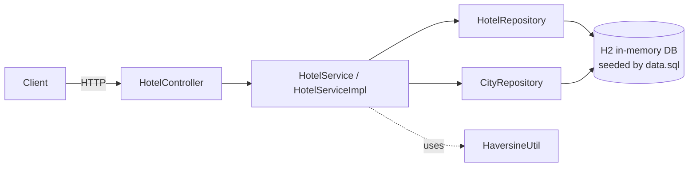
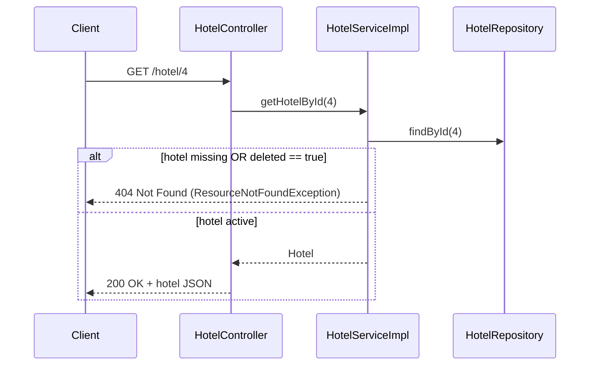
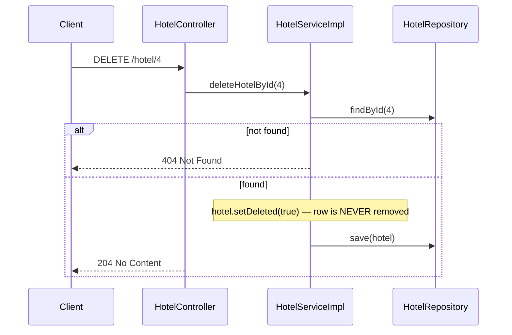
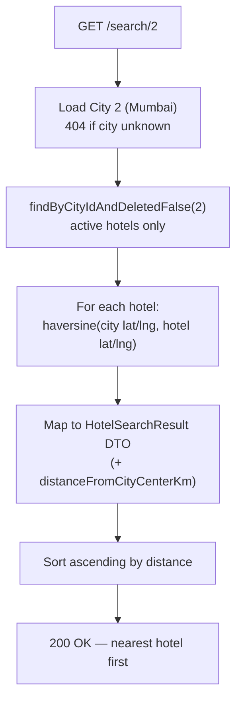

# Hotel Service — Project Flow

A Spring Boot REST service (Boot 4.1.0, Java 21, H2 in-memory DB) simulating the HackerRank
hotel question: fetch a hotel, soft-delete a hotel, and search a city's hotels sorted by
distance from the city center.

## The big picture

Every request passes through the same four layers. No layer skips another: the controller
never touches a repository, and the service never builds HTTP responses.



| Layer | Class | Responsibility |
|---|---|---|
| Controller | `HotelController` | Maps URLs to service calls, wraps results in `ResponseEntity` |
| Service | `HotelServiceImpl` | Business rules: not-found checks, soft-delete flag, distance sort |
| Repository | `HotelRepository`, `CityRepository` | Spring Data JPA queries — no hand-written SQL |
| Model | `Hotel`, `City` | JPA entities; `Hotel.deleted` is the soft-delete flag |

At startup, Hibernate creates the schema from the entities (`ddl-auto=create`), then
`data.sql` seeds 3 cities and 10 hotels (one pre-marked `deleted = true`).

## Q1 — `GET /hotel/{id}`



The key rule: a soft-deleted hotel is treated exactly like a missing one — the API returns
404 even though the row still exists.

## Q2 — `DELETE /hotel/{id}` (soft delete)



After this, `GET /hotel/4` returns 404 and `/search/{cityId}` excludes it — but
`SELECT * FROM hotel WHERE id = 4` still shows the row with `DELETED = TRUE`.

## Q3 — `GET /search/{cityId}` (closest to city center)



The distance comes from `HaversineUtil.distanceKm` — the haversine great-circle formula
with Earth radius 6371 km:

```
a = sin²(Δlat/2) + cos(lat1)·cos(lat2)·sin²(Δlon/2)
d = 2R · atan2(√a, √(1−a))
```

## Where the data lives

- `application.properties` — H2 URL `jdbc:h2:mem:hoteldb`, H2 console at `/h2-console`,
  `defer-datasource-initialization=true` so `data.sql` runs after Hibernate builds the schema.
- `data.sql` — cities: New Delhi (1), Mumbai (2), Bengaluru (3); hotels 1–10 with real-ish
  coordinates. Hotel 10 is seeded as already deleted, proving the search filter works.
- In-memory DB: every restart resets to this seed state.

## Running and verifying

```bash
./mvnw spring-boot:run          # start on :8080
curl localhost:8080/hotel/1     # Q1
curl -X DELETE localhost:8080/hotel/4   # Q2
curl localhost:8080/search/2    # Q3 — nearest first
./mvnw test                     # 8 tests: 7 MockMvc integration + context load
```

The integration test (`HotelControllerIntegrationTest`) covers every branch above:
200/404 on get, soft-delete persistence, distance ordering, deleted-hotel exclusion,
and 404 for an unknown city.
